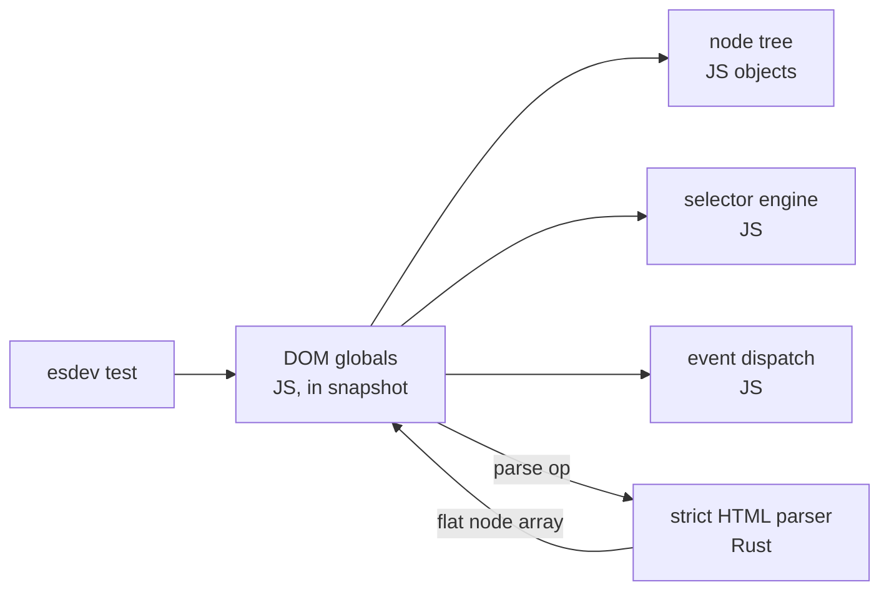
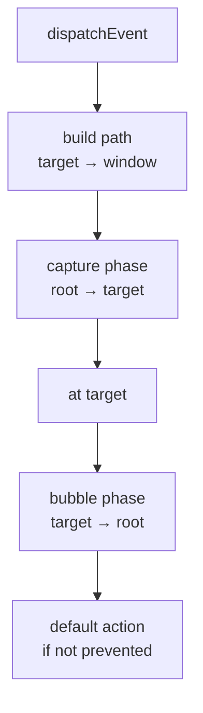

# esdev DOM — implementation spec

2026-09-19 · @Someone

## Scope and non-goals

A DOM built into `esdev` and used only by its test runner. It does not ship in `esrun`, and it is not shared with OTF Browser — a browser wants its tree in Rust next to layout, which is the opposite of the design below.

The target is spec fidelity without layout. Algorithms that do not need a box model are implemented to the letter of the DOM, HTML, UI Events and Selectors specs. Everything that needs layout is absent and says so.

**In scope**

- `Node`, `Element`, `Document`, `DocumentFragment`, `Text`, `Comment`, `Attr`, `DOMTokenList`, `NamedNodeMap`
- Spec mutation algorithms: pre-insert, insert, adopt, remove, replace, including node-document and removing-steps hooks
- Live `HTMLCollection` and `NodeList`
- Full event dispatch: propagation path, capture, bubble, `composedPath()`, `stopPropagation`, `stopImmediatePropagation`, `preventDefault`, `once`, `passive`, `signal`
- `MutationObserver`, delivered at the microtask checkpoint
- HTML parsing: document and fragment, via an in-tree strict modern-HTML parser
- `<template>` with its inert content document
- Selectors: `querySelector`, `querySelectorAll`, `matches`, `closest`, including `:is()`, `:where()`, `:has()`, `:not()`
- Inline `style` object and `classList`
- `customElements` with upgrades and reaction callbacks
- `Range`, limited to what `createContextualFragment` and node-boundary work need

**Out of scope, deliberately**

- Layout. `getBoundingClientRect()`, `offsetWidth`, `scrollTop` return zeros rather than throwing, so feature-probing code runs instead of exploding.
- Used values. The cascade is implemented (see [Styles](#styles)) and `getComputedStyle` answers with *specified* values: a percentage stays a percentage, `auto` stays `auto`, `2em` stays `2em`. Resolving those needs layout.
- Navigation: no real `location` changes, no history side effects, no `document.write`.
- `XMLHttpRequest`. `fetch` is the runtime's own.
- Shadow DOM has tree and event-boundary support (`attachShadow`, open/closed
  roots, scoped selectors, composed events with host retargeting, and basic
  named/default slot assignment), but does not implement style scoping.
- `contenteditable`, drag and drop, pointer capture, focus rings.
- The HTML4 event-interface aliases. `document.createEvent` exists and takes a
  modern interface name — `"Event"`, `"MouseEvent"`, `"KeyboardEvent"` — while
  `"HTMLEvents"`, `"UIEvents"` and `"MouseEvents"` are refused by name with the
  constructor to use instead.

This is not a headless browser and will never pass a test that depends on how something looks. Pixel tests belong to the GUI driver harness.

## Architecture

The node tree lives in JavaScript. Rust does HTML parsing and nothing else.

The DOM is synchronous and extremely chatty: one component render walks `parentNode`, reads `textContent`, sets attributes thousands of times. A Rust-resident tree turns every one of those into a boundary crossing, and `runtime:` modules are async by design — `document.createElement()` returning a promise is not a DOM. Keeping the tree in JS avoids both problems and lets V8's GC own node lifetime, with no handle table to leak.

The parser stays in Rust, but is deliberately small and owned here. It accepts
well-nested modern HTML and rejects malformed or legacy-recovery-dependent
markup rather than silently repairing it. That is a single op per parse, not
per node.



The parse op takes a string plus an optional context element name and returns a flat array of node records — `[kind, parentIndex, name, attrs, text]` — encoded as MessagePack, which `esrun` already has. The JS side builds real nodes from that array in one pass. One crossing per `innerHTML` assignment, regardless of tree size.

Selector matching stays in JS. A Rust matcher cannot walk a JS tree, so a Rust selector crate would buy nothing here — the parse is a few hundred microseconds at most and the matching is where the time goes.

The whole JS layer is baked into the `esdev` V8 startup snapshot. It costs nothing at boot for runs that never touch the DOM, because the objects are already in the snapshot heap and untouched pages stay untouched.

## Source layout

The implementation lives in `dev-cli`, which is the only binary allowed to
expose the DOM. Its JS classes are a realm-local factory: the test runner will
install a fresh set per test file rather than share global DOM state.

| Path | Language | Holds |
| --- | --- | --- |
| `crates/dev-cli/src/dom/html.rs` | Rust | strict HTML parser, flat-record encoder, op registration |
| `crates/dev-cli/src/dom/tree.js` | JS | realm-local Node, Element, Document, mutation algorithms, collections |
| `crates/dev-cli/src/dom/events.js` | JS | EventTarget, Event and subclasses, dispatch |
| `crates/dev-cli/src/dom/parse.js` | JS | node-array decoder, fragment-parsing entry points, serializer |
| `crates/dev-cli/src/dom/select.js` | JS | selector parser, compiled matcher |
| `crates/dev-cli/src/dom/css.js` | JS | CSSStyleDeclaration, property name mapping, shorthand handling |
| `crates/dev-cli/src/dom/elements.js` | JS | HTMLElement subclasses, reflected attributes, customElements |
| `crates/dev-cli/src/dom/window.js` | JS | window, document construction, timers bridge, stubs |

Internal state hangs off symbols, not underscore-prefixed properties, so user code walking an element sees only the spec surface. Every class uses the same private-slot helper rather than a mix of closures, `WeakMap` and `#fields`; mixed approaches make the invariants hard to audit later.

Reflected attributes (`id`, `className`, `htmlFor`, `value`, and roughly two hundred more) are generated from a table rather than hand-written. Hand-writing them is where subtle bugs settle in — `htmlFor` maps to `for`, `className` to `class`, boolean reflections coerce differently from string ones.

The serializer is JS, not Rust. Serialization is a short, exactly-specified algorithm with escaping rules that differ per context, and keeping it in JS avoids a second crossing on every `outerHTML` read.

## Core DOM

Nodes hold sibling pointers, not child arrays: `firstChild`, `lastChild`, `previousSibling`, `nextSibling`, `parentNode`. An array of children makes `childNodes` trivial and every `insertBefore` O(n); a linked list makes insertion O(1), which matches how frameworks actually mutate.

Every mutation goes through the spec algorithms, never through a shortcut. `appendChild`, `insertBefore`, `replaceChild`, `removeChild`, `remove()`, `before/after/replaceWith`, `append/prepend`, and the `innerHTML` setter all funnel into pre-insert, insert, remove. That is what makes hierarchy errors, fragment flattening, and document adoption come out right without special-casing each entry point.

**Live collections are the part most implementations fake.** `childNodes`, `children`, `getElementsByTagName`, `getElementsByClassName` and `form.elements` are live: a node appended after the collection was obtained must appear in it. The mechanism is a monotonically increasing version counter on the document, bumped by every insert and remove. A collection caches its result plus the version it was computed at, and recomputes when the counter moved. Collections also cache by index for sequential iteration, because `for (i = 0; i < el.children.length; i++)` is common and otherwise quadratic.

Attributes are `Attr` nodes in a `NamedNodeMap`, not a plain string map. `getAttributeNode`, attribute namespaces, and `attributes[0].name` all fall out of that, and `MutationObserver` attribute records need the old value anyway.

`textContent` on an element is a full-subtree walk on read and a replace-all on write. `innerText` is not implemented — it is layout-dependent by definition, and returning `textContent` for it would be a lie that passes tests locally and fails in a browser.

`cloneNode(true)` is a spec clone: it copies attributes, runs the cloning steps for `<template>` (which clones the content fragment separately), and does not copy event listeners or private framework state. This path matters more than usual here — see the OTF Web section.

`MutationObserver` queues records and delivers them at the microtask checkpoint, which means hooking V8's microtask queue from the JS side via `queueMicrotask` and a delivery flag, not a `setTimeout(0)`. Getting this wrong makes framework effect scheduling behave differently under test than in a browser, which is the exact failure mode a test DOM exists to prevent.

## Events

`EventTarget` is a standalone class that `Node`, `Window` and `AbortSignal` all extend, so `addEventListener` works on non-nodes.

Dispatch computes the propagation path first — walking `parentNode` up to the document and window — then freezes it. Listeners that mutate the tree mid-dispatch do not change where the event goes next, which is spec behaviour and is easy to get wrong by walking the tree lazily.



Per listener: `capture`, `once`, `passive`, `signal`. `stopPropagation` ends the phase after the current node; `stopImmediatePropagation` ends it after the current listener. `preventDefault` is ignored on a passive listener, and sets `defaultPrevented` only when the event is cancelable.

Event constructors implemented: `Event`, `CustomEvent`, `UIEvent`, `MouseEvent`, `KeyboardEvent`, `InputEvent`, `FocusEvent`, `PointerEvent`, `SubmitEvent`, `ErrorEvent`, `PromiseRejectionEvent`. `MouseEvent` and `PointerEvent` carry coordinate fields that are always zero, since there is no layout to derive them from.

**Detached trees dispatch normally.** An event fired on a node with no parent propagates to that node and stops. Portal-style rendering and unmount-then-assert test patterns both hit this, and an implementation that assumes a document root breaks on both.

Default actions are implemented only where a test would notice: `click()` on a checkbox toggles `checked`, on a radio updates the group, on a `<label>` forwards to the labeled control, and on a submit button fires `submit` at the form. Form submission itself does nothing beyond the event — there is no navigation to perform.

No trusted/untrusted distinction: `isTrusted` is `false` for everything constructed in JS, which is correct, and there is no user-agent path that produces `true`.

## HTML parsing

An in-tree strict modern-HTML parser, called through one synchronous op. It
accepts lower-case HTML names, explicit nesting, void elements, quoted and
unquoted attributes, comments, `<!doctype html>`, text and the small entity
set test fixtures need. `<script>` and `<style>` are raw-text elements.

It rejects malformed markup with a byte offset: omitted or mismatched end tags,
duplicate attributes, legacy upper-case markup, unsupported doctypes, malformed
comments and unknown character references. It deliberately does **not** perform
HTML's compatibility recovery algorithms: no implied tags, foster parenting,
active-formatting-element repair, adoption agency algorithm or quirks mode.
That makes a bad test fixture fail at the source rather than become a different
tree behind the test's back.

Two entry points:

1. **Document parse** — a full string to a document, used by `esdev test` when a test declares starting HTML, and by hydration tests that feed in SSG output.
2. **Fragment parse** — a string plus a context element, used by `innerHTML`, `outerHTML`, `insertAdjacentHTML` and `Range.createContextualFragment`.

The context element remains part of fragment parsing. Table-specific recovery
and unsupported contexts fail explicitly; there is no browser-style table
recovery. Element content-model validation is deliberately deferred until the
DOM element layer defines the supported HTML element set.

**Whitespace and text nodes are preserved exactly as the parser emits them.** No coalescing, no trimming, no normalization. Hydration walks server HTML expecting an exact node sequence, so a parser that tidies text nodes breaks adoption in ways that look like framework bugs.

The op returns a flat array of records rather than a nested structure, because MessagePack encoding of a flat array with parent indices is cheaper to produce in Rust and cheaper to walk in JS than a tree of maps. Each record: node kind, parent index, name, attribute pairs, text content. The JS decoder makes one pass, constructing real nodes and linking siblings as it goes.

`<template>` gets special handling on both sides: its children go into a separate content fragment owned by an inert template document, not into the template element itself. This is the single most load-bearing detail for a compiler-based framework.

Serialization back to HTML is JS. The algorithm is short and its escaping rules differ by context — text nodes escape `&`, `<`, `>`; attribute values escape `&`, `"` and non-breaking space; `<script>` and `<style>` content is not escaped at all; void elements take no closing tag.

## Selectors

A JS selector parser producing a compiled matcher, cached by selector string.

The parser handles the Selectors Level 4 grammar that non-layout matching allows: type, universal, `#id`, `.class`, `[attr]` with all six operators and case-insensitivity flags, descendant, child, next-sibling, subsequent-sibling, and the selector list.

Pseudo-classes implemented: `:is()`, `:where()`, `:not()`, `:has()`, `:root`,
`:empty`, child and type positions (`:first-*`, `:last-*`, `:only-*`),
`:nth-child()`, `:nth-last-child()`, `:nth-of-type()`, `:nth-last-of-type()`,
`:focus`, `:scope`, `:checked`, `:disabled`, `:enabled`, `:required`,
`:optional`, and `:link`.

Other pseudo-classes are rejected with `SyntaxError` until their state and
matching rules are implemented.

Deliberately absent, with the reason: `:hover`, `:focus-visible`, `:active` need user interaction state; `:visited` needs history; `:target` needs navigation. `:focus` is supported, because `document.activeElement` is tracked — see the window section.

Matching runs right to left from the candidate element, which is what browsers do and what makes descendant combinators cheap. `querySelectorAll` walks the subtree in tree order and filters; the compiled matcher exposes a fast path for the common single-simple-selector cases (`.class`, `#id`, `tag`) that skips the general machinery.

`:has()` is the exception to right-to-left — it needs a forward subtree search per candidate. It is implemented plainly, without the invalidation machinery a live style engine needs, because a test DOM re-evaluates on demand rather than maintaining matched sets.

Specificity is computed and exposed internally even though there is no cascade, because `:is()` and `:not()` take specificity from their most specific argument, which affects nothing today but is needed if a cascade is ever added.

Invalid selectors throw `SyntaxError` with the offending position. Tests that assert on malformed selectors are rare; tests that silently pass because a bad selector matched nothing are a real hazard.

## Styles

Inline styles, stylesheets and the cascade — but specified values only, because
resolving a used value needs layout.

`element.style` is a real `CSSStyleDeclaration`: `setProperty`, `removeProperty`, `getPropertyValue`, `getPropertyPriority`, indexed access, `length`, `cssText` both ways, and camelCase property accessors. It stays in sync with the `style` attribute in both directions — writing the attribute reparses the declaration, writing a property reserializes the attribute.

Property values are stored as written and lightly normalized, not computed. `style.width = '10px'` reads back `10px`; `style.color = 'red'` reads back `red`, not `rgb(255, 0, 0)`. Browsers do normalize colors, so this is a known divergence, and the alternative is a colour parser plus a per-property value grammar for the sake of assertions that tests should not be making.

Shorthands expand: setting `margin` sets the four longhands and setting a longhand updates the shorthand's serialization. This is the one place where per-property knowledge is unavoidable, and it is table-driven for the common shorthands — `margin`, `padding`, `border`, `background`, `font`, `flex`, `grid-template`, `inset`, `gap`, `overflow`.

Custom properties (`--x`) pass through untouched, since their value grammar is deliberately open.

### The cascade

A `<style>` element has a real `sheet`, `document.styleSheets` lists them,
`CSSStyleSheet` is constructable with `replaceSync`, and `adoptedStyleSheets`
works on a document and on a shadow root. Stylesheets are parsed by the build
pipeline's own CSS parser (`crates/dev-cli/src/css`), so a stylesheet means the
same thing to `esdev build` and to `esdev test --dom`.

`getComputedStyle(el)` resolves a **specified** value, in the order the cascade
specifies:

| Step | What it does |
| --- | --- |
| Origin and importance | normal user-agent, normal author, the `style` attribute, important author, an important `style` attribute, important user-agent |
| Specificity | `[ids, classes, types]`, with `:is()`/`:not()`/`:has()` taking their most specific argument and `:where()` taking none |
| Order | the later declaration in the sheet wins a tie |
| Inheritance | the inherited properties, and any explicit `inherit`, come from the parent; a custom property always does |
| Initial values | the keyword initial values — `display: inline`, `font-weight: 400`, `visibility: visible`, `color: rgb(0, 0, 0)` — for anything still unset |

A declaration list is the surface of the known properties, as in a browser: an
unknown name reads `undefined` and `"nonsense" in style` is false, while a known
property that nothing set reads `""`. Custom properties are always known.

`@media` is evaluated against a **declared viewport**: `window.innerWidth` and
`innerHeight` start at 1024×768 and are assignable, since nothing here resizes
on its own, and `matchMedia` answers from the same state rather than always
saying `false`. `@supports` is answered by what this DOM can parse — a
declaration it keeps is supported, a selector it can compile is supported.

CSS nesting is flattened when a sheet is parsed: `& a` becomes `:is(parent) a`,
which is the specificity the specification gives it. It is the resolved rules
that appear in `cssRules`, where a browser would show the nested structure.

A user-agent stylesheet supplies what a layout-free DOM can honestly report —
which elements are blocks, list items, table parts or hidden, and the handful of
text defaults — and nothing about how anything looks.

### What the cascade does not do

- **No used values.** A length is what was written. `getComputedStyle(h1).fontSize`
  is `2em` here and `32px` in a browser, because resolving it needs a font and a
  parent box. Assertions on resolved lengths, colours a browser normalises, or
  anything geometric belong in the GUI driver harness.
- **An element outside the tree has no computed style at all**, as in a browser.
- **A pseudo-element has none either**: `getComputedStyle(el, '::before')` is
  empty, and a rule whose selector names a pseudo-element is not applied to the
  element.
- **A rule this DOM cannot match contributes nothing** and is not an error —
  it still appears in `cssRules`. That covers a pseudo-element selector and any
  selector the engine cannot compile.
- **`@supports` answers from a list of known properties** (`css.js`), not from
  what anything renders. A property the list is missing answers "not supported",
  so a genuinely new one has to be added there — a one-line change — rather than
  being guessed at.
- **`@layer` does not order anything** and `@container` has no container: their
  blocks contribute as if the condition held.

## Window surface

`window` is the global object of the test realm, with `window === globalThis` and `window.window === window`, because libraries check both.

**Implemented for real**

- `document`, `navigator` (`userAgent` identifying esdev, `language`, `languages`), `location` as a parsed URL that can be read and assigned, with assignment recording the target rather than navigating
- `history` with `pushState`, `replaceState`, `back`, `forward`, an in-memory entry list and `popstate` events — routers need this and it costs little
- `localStorage` and `sessionStorage` as real `Storage` objects, cleared between test files
- `requestAnimationFrame` and `cancelAnimationFrame` on a fake clock the test runner can advance
- `getComputedStyle`, `queueMicrotask`, `structuredClone`, `atob`, `btoa`, timers — the last several come from the runtime and are simply exposed
- `document.activeElement`, `focus()`, `blur()`, and the `focus`/`blur`/`focusin`/`focusout` events, with focusability decided by tag and `tabindex` rather than by visibility

**Constructible, never firing**

`matchMedia` (returns a `MediaQueryList` that never matches and never changes),
`IntersectionObserver`, and `ResizeObserver`. These exist so components that
observe on mount do not crash; they will not deliver entries, and the docs must
say so rather than letting someone discover it in a failing test.

**Custom elements: in.**

OTF Web describes itself as built on standard Web Components, so `customElements` is in scope: `define`, `get`, `whenDefined`, `upgrade`, plus `connectedCallback`, `disconnectedCallback`, `adoptedCallback`, `attributeChangedCallback` with `observedAttributes`. This is the most invasive item in the spec — the custom element reaction stack threads through every mutation method and the parser has to upgrade elements as it constructs them — so it is built into the mutation algorithms from the start rather than retrofitted.

**Scoped custom element registries: out.** `new CustomElementRegistry()` used
with `attachShadow({ customElements })` or `createElement(name, {
customElementRegistry })` is a proposal. A registry that is not the document's
keeps its own definitions — so `define` on it is independent, as the
specification's per-registry checks require — and upgrades nothing.

**Shadow DOM: out, unless a check says otherwise.**

Scoped CSS Modules and a context API that crosses Portal boundaries both suggest otfw scopes styles by class name rather than by shadow root. If that is right, shadow DOM stays out, and that is a large saving: retargeting rewrites event dispatch, slot assignment rewrites the flattened tree, and selector matching gains a second traversal mode. The check is a grep for `attachShadow` in the otfw runtime and its compiled output. If it appears, this section is wrong and the event and selector designs above need revisiting before implementation, not after.

## esdev test integration

Off by default. A test file opts in, per file or per config:

```
esdev test --dom
```

or a per-file directive, so a mixed suite does not pay for a DOM in its server tests.

**Isolation is a fresh V8 context per test file.** Rebuilding the DOM in JS between files is faster but leaks anything that closed over a global — a module-level `document.addEventListener`, a framework singleton, a custom element registration that cannot be undone. `customElements.define` is one-way by spec, so a shared registry across files means the second file that defines the same tag throws. A fresh realm makes that impossible rather than merely unlikely. The snapshot makes realm creation cheap, which is what makes this affordable.

Globals are installed onto the realm's global object: `window`, `document`, `navigator`, `location`, `history`, `localStorage`, `sessionStorage`, `customElements`, `HTMLElement` and the element class hierarchy, the event constructors, the observers. Libraries feature-detect with `typeof document !== 'undefined'`, so partial installation is worse than none.

The starting document is `<!DOCTYPE html><html><head></head><body></body></html>` unless the test supplies HTML, and a supplied string goes through the full document parse so hydration tests start from exactly what SSG emitted.

**Capabilities: none.** The DOM touches no host resource — no file, no socket, no subprocess. `--dom` grants nothing and requires nothing, which keeps the deny-by-default story intact. `location` and `history` are in-memory objects that never reach the network. This is worth stating in the docs, because a DOM sounds like it should need permissions and it does not.

The fake clock for `requestAnimationFrame` is shared with whatever timer control the test runner already exposes, so a test that advances timers also advances animation frames. Two independent clocks would be a source of confusing failures.

## OTF Web support

otfw is the first consumer, and a zero-VDOM compiler stresses a different part of the DOM than a virtual-DOM library does.

| otfw feature | What the DOM must get right |
| --- | --- |
| JSX compiled to native DOM | `<template>` content fragments, `cloneNode(true)`, `importNode` |
| List and conditional blocks | Comment nodes as anchors, `insertBefore` against a comment, removal between two anchors |
| Fine-grained signal updates | `nodeValue` and `textContent` writes on individual text nodes, attribute writes without reparse |
| Event handling | Delegation from a root, correct `target` vs `currentTarget`, `composedPath()` |
| Portal | Dispatch on detached subtrees, multiple roots under `document.body` |
| Hydration | Parser fidelity: whitespace text nodes preserved, no text coalescing, exact node counts |
| `$ref` | Element identity stable across clone and insert |
| Web Components | `customElements.define`, upgrade on append and on parse, lifecycle callbacks |
| Scoped CSS Modules, Tailwind | `className` and `classList` only — no computed style needed |
| SSR and SSG | No DOM at all; these render to strings |

**Establish the real surface before writing code.** otfw already has a testing library and a suite that presumably runs on vitest with jsdom. Wrap jsdom's prototypes in recording proxies, run that suite, and collect every property and method touched with call counts. That produces the actual required surface and settles the `attachShadow` question in one run.

The recording sets implementation *priority*, not *semantics*. Building only what otfw calls, shaped the way otfw happens to call it, produces a mock that passes today and breaks on the next framework feature. Order from the recording; behaviour from the specs.

The acceptance gate for this phase is otfw's existing component test suite passing under `esdev test --dom` with no source changes to otfw itself. If otfw needs edits to run, the DOM is wrong, not otfw.

## Conformance

"Close to spec" only means something if it is measured. Four measurements, and
[`ESDEV-DOM-PARITY.md`](ESDEV-DOM-PARITY.md) publishes what they record.

| Measurement | Task | What it gates |
| --- | --- | --- |
| Module unit tests | `tsr test:dom-unit` | the tree, events, parsing, ranges, sheets and selectors, on esdev's own binary |
| WPT slice | `tsr test:dom-wpt` | `dom`, `custom-elements`, `shadow-dom` against `wpt/dom-expectations.json` |
| Behaviour matrix | `tsr test:dom-matrix` | every case matching headless Chrome, and no drift |
| Surface probe | `tsr test:dom-surface` | no drift in what 192 features answer, in all four runtimes |

The matrix and the probe run the same code under Chrome, esdev, jsdom and
happy-dom. Chrome is the oracle; the emulators are context, never a verdict. A
difference from Chrome is either fixed or written down with its reason — the
parity document fails to generate if one has no reason, which is what keeps the
boundary from quietly moving.

The WPT slice is the external half of the same question.

| Suite | Covers | Notes |
| --- | --- | --- |
| Strict HTML parser corpus | Accepted modern grammar, rejection diagnostics | Owned fixtures for every accepted construct and rejected recovery case |
| WPT `dom/nodes` | Tree mutation, adoption, collections, attributes | The core target |
| WPT `dom/events` | Dispatch, propagation, listener options | The second core target |
| WPT `css/selectors` | Selector parsing and matching | Skip the layout-dependent files |
| WPT `custom-elements` | Upgrades, reactions, callbacks | Reveals reaction-stack ordering bugs early |

WPT files are run through a small harness that provides `testharness.js` against this DOM. Tests needing layout, navigation or networking are excluded by an explicit skip list with a reason per entry — not by silently letting them fail. The skip list is the honest statement of what this DOM is not, and it belongs in the published docs.

Pass rates are recorded per directory and tracked over time, so a refactor that regresses selector matching shows up as a number rather than as a mystery in someone's test suite. Publishing those numbers is a stronger claim than jsdom makes cleanly.

The bar for merging a feature: its WPT directory pass rate does not go down, and the otfw suite still passes.

## Build order

Each step ends with something runnable, and nothing later forces a rewrite of anything earlier.

1. **Record the surface.** Recording proxies over jsdom, otfw suite, call counts out. Settles `attachShadow` and orders everything below.
2. **Tree core.** Nodes, sibling pointers, the mutation algorithms, `Attr` and `NamedNodeMap`, document version counter. Gate: WPT `dom/nodes` running, even at a low pass rate.
3. **Live collections.** `childNodes`, `children`, `getElementsBy*`, index caching. These must come before anything that iterates, or the iteration code gets written against arrays.
4. **Events.** `EventTarget`, dispatch, the event classes, focus tracking. Gate: WPT `dom/events`.
5. **Parse op.** The in-tree strict parser, flat record format, JS decoder, `innerHTML` and fragment parsing with context elements, `<template>`. Gate: strict-parser corpus.
6. **Serializer.** `outerHTML`, `innerHTML` getter, escaping per context.
7. **Selectors.** Parser, compiled matcher, the fast paths. Gate: WPT `css/selectors`.
8. **HTML element classes and reflection.** The generated attribute table, form controls, `click()` defaults.
9. **Inline styles.** `CSSStyleDeclaration`, shorthand table, `style` attribute sync.
10. **Custom elements.** Registry, upgrades, the reaction stack through the mutation algorithms and the parser. Gate: WPT `custom-elements`.
11. **Window and stubs.** `location`, `history`, storage, rAF on the test clock, the never-firing observers.
12. **Test runner integration.** `--dom` flag, per-file realm, global installation, starting HTML.
13. **otfw green.** Run otfw's suite unmodified. Fix the DOM, not otfw.
14. **Publish the numbers.** WPT pass rates and the skip list in the `esdev` docs.

Steps 2 through 4 are the foundation everything else assumes; if the reaction stack from step 10 was not anticipated in step 2's mutation algorithms, step 10 becomes a rewrite. That is the one ordering risk in the list, and it is why custom elements are decided in scope now rather than later.
